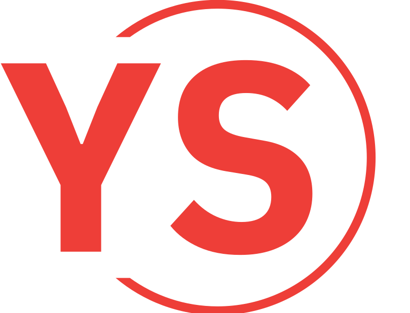

<a name="readme-top"></a>

<div align="center">

  
  <br/>

  <h3><b>Youtube sharing app</b></h3>

</div>

<!-- TABLE OF CONTENTS -->

# 📗 Table of Contents

- [📖 About the Project](#about-project)
  - [🛠 Features](#features)
  - [🛠 Built With](#built-with)
  - [🛠 Kanban board](#kanban-board)
  - [🚀 Live Demo](#live-demo)
- [💻 Getting Started](#getting-started)
  - [Setup](#setup)
  - [Prerequisites](#prerequisites)
  - [Install](#install)
  - [Usage](#usage)
  - [Run tests](#run-tests)
  - [Deployment](#triangular_flag_on_post-deployment)
- [👥 Authors](#authors)
- [🔭 Future Features](#🔭-future-features)
- [🤝 Contributing](#🤝-contributing)
- [🙏 Acknowledgments](#🙏-acknowledgments)
- [📝 License](#📝-license)


<!-- PROJECT DESCRIPTION -->

# 📖 Youtube sharing app <a name="about-project"></a>

This App allow users share their favorite youtube video.

## 🔭 Features <a name="features"></a>
- [ ] **Sign in && Sigup**
- [ ] **Notification**
- [ ] **Sharing video**
- [ ] **Display video shared**
- [ ] **Detele video shared**

## 🛠 Built With <a name="built-with"></a>

### Front-end

* [![React][React.js]][React-url]
* [![Redux][redux.js]][Redux-url]
* [![TailwindCSS][TailwindCSS]][tailwind-url]

### Back-end

* [![NodeJS][NodeJS]][Nodejs-url]
* [![ExpressJS][ExpressJS]][expressjs-url]
* [![SocketIO][SocketIO]][socketio-url]
* [![JWT][jwt]][jwt-url]

### Database

* [![MongoDB][MongoDB]][Mongodb-url]

### Development tools

* [![Docker][docker]][docker-url]
* [![PostMan][postman]][postman-url]
* [![Vite][Vite]][vite-url]

### Deployment flatform

* [![Render][Render]][render-url]

## 🛠 Kanban board <a name="kanban-board"></a>

For management this project, I setup kanban board in which I splited project into a bundle of tasks. [Click here](https://github.com/users/hienphan0111/projects/12) to overview this kanban board.


<p align="right">(<a href="#readme-top">back to top</a>)</p>

## 🚀 Live Demo <a name="live-demo"></a>
To see the demo version, you can [Clik here](https://youtube-sharing-l4x6.onrender.com/)
- Want to try admin features, use below account:


<!-- GETTING STARTED -->

## 💻 Getting Started <a name="getting-started"></a>

To get a local copy up and running, follow these steps.

### Prerequisites

- IDE(code editor) like: **Vscode**, **Sublime**, etc. 
- [Git](https://www.linode.com/docs/guides/how-to-install-git-on-linux-mac-and-windows/)

### Setup

1. Download the **Zip** file or clone the repo with:
```bash
  git clone https://github.com/hienphan/youtube-sharing.git
```
3. To access cloned directory run:
```bash
  cd youtube-sharing
```

### Install

4. Access front end
> To install linters and other project's dependencies run:
```bash
  npm install
```

- run command 
```bash
  cd client
```

- Setup .env file:
  - Create an .env file and put it in client folder and your back-end url variable here.

```bash
  VITE_API_URL=<API_URL>
```

To run the front, execute the following command:

```bash
  npm dev
```

5. Access back end
> To install linters and other project's dependencies run:
```bash
  yarn install
```

- run command 
```bash
  cd back-end
```

- Setup .env file:
  - Create an .env file and put it in client folder and your data base url and secret key variable here.

```bash
  MONGO_URL=<DATABASE_URL>
  JWT_SECRET=<SECRET_JSON_TOKEN>
```

To run the api, execute the following command:

```bash
  yarn start
```

### Implement docker

1. Verify Docker version and also login to Docker Hub

```bash
  docker version
  docker login
```

2. Pull Image from Docker Hub

```bash
  docker pull --all-tags kevinphan0111/youtubesharing 

```

3. Run the downloaded Docker Image & Access the Application

```bash
  docker build -t mongo:latest
  docker run --name client -p 3000:3000 -d kevinphan0111/youtubesharing:client
  docker run --name api -p 5000:5000 -d kevinphan0111/youtubesharing:api
```

4. Connect to Container Terminal

```bash
  docker exec -it youtube-sharing /bin/sh 

```

5. Container Stop, Start

```bash
  docker stop <container-name>
  docker start  <container-name>

```

5. Acces app in browser

```bash
  http://localhost:3000

```

<!-- 
- Run
```bash
bundle install
```

- Run command below to create client_id and secret on your local database
```bash
rails console
```
- Then create an OAuth application using this command :
```bash
oauth = Doorkeeper::Application.create(name: "Web client", redirect_uri: "", scopes: "")
```
- You can change the name to any name you want, and leave redirect_uri and scopes blank.

- Then run below command to get client_id
```bash
oauth.uid
```

- Get client_secret by below command
```bash
oauth.secret
```

- Finnaly, create .env file in the root folder with content:
```bash
VITE_CLIENT_ID=client_id
VITE_CLIENT_SECRET=client_secret
```
replace client_id and client_secret with info that you got above

- To use admin features, you can create an account on front end then run `rails console`
- Find the user that you just created and set isAdmin to true, example:
```bash
user = User.find_by(email: "email@email.com")
user.isAdmin = true
user.save
```
- Comeback your front end and login again
- The Admin features should appear on your side bar.

### Usage

-->

<!--
Example command:

```sh
  rails server
```
--->

### Run tests

To run tests, run the following command:


navigate to client folder:

```sh
  npm run test
```
-

<p align="right">(<a href="#readme-top">back to top</a>)</p>

<!-- AUTHORS -->

## 👥 Authors <a name="authors"></a>

👤 **Hien Phan**
- GitHub: [@hienphan0111](https://github.com/hienphan0111)
- Twitter: [@hienphan0111](https://twitter.com/twitterhandle)
- LinkedIn: [LinkedIn](https://www.linkedin.com/in/hien-phan-61097b256/)

<p align="right">(<a href="#readme-top">back to top</a>)</p>

<!-- FUTURE FEATURES -->

## 🔭 Future Features <a name="future-features"></a>

- [ ] **Admin Dashboard**


<p align="right">(<a href="#readme-top">back to top</a>)</p>

<!-- CONTRIBUTING -->

## 🤝 Contributing <a name="contributing"></a>

Contributions, issues, and feature requests are welcome!

Feel free to check the [issues page](../../issues/).

<p align="right">(<a href="#readme-top">back to top</a>)</p>

<!-- ACKNOWLEDGEMENTS -->

## 🙏 Acknowledgments <a name="acknowledgements"></a>

<!-- FAQ (optional) -->

## 📝 License <a name="license"></a>

This project is contributed under [GNU 3.0](./LICENSE.md) and [Creative commons](https://creativecommons.org/licenses/by-nc/4.0/) licensed


<p align="right">(<a href="#readme-top">back to top</a>)</p>

<!-- MARKDOWN LINKS & IMAGES -->
<!-- https://www.markdownguide.org/basic-syntax/#reference-style-links -->
[React.js]: https://img.shields.io/badge/React-20232A?style=for-the-badge&logo=react&logoColor=61DAFB
[React-url]: https://reactjs.org/
[Redux.js]: https://img.shields.io/badge/-Redux-20232A?style=for-the-badge&logo=redux&logoColor=violet
[Redux-url]: http://redux.js.org
[TailwindCSS]: https://img.shields.io/badge/Tailwind_CSS-38B2AC?style=for-the-badge&logo=tailwind-css&logoColor=white
[Tailwind-url]: http://tailwind.org
[Render]: https://img.shields.io/badge/Render-46E3B7?style=for-the-badge&logo=render&logoColor=white
[Render-url]: http://render.com
[MongoDB]: https://img.shields.io/badge/MongoDB-4EA94B?style=for-the-badge&logo=mongodb&logoColor=white
[Mongo-url]: http://mongodb.org
[Docker]: https://img.shields.io/badge/Docker-2CA5E0?style=for-the-badge&logo=docker&logoColor=white
[Docker-url]: http://docker.com
[JWT]: https://img.shields.io/badge/JWT-000000?style=for-the-badge&logo=JSON%20web%20tokens&logoColor=white
[JWT-url]: http://jwt.com
[NodeJS]: https://img.shields.io/badge/Node.js-339933?style=for-the-badge&logo=nodedotjs&logoColor=white
[Nodejs-url]: http://nodejs.org
[ExpressJS]: https://img.shields.io/badge/Express.js-000000?style=for-the-badge&logo=express&logoColor=white
[Express-url]: http://expressjs.org
[PostMan]: https://img.shields.io/badge/Postman-FF6C37?style=for-the-badge&logo=Postman&logoColor=white
[Postman-url]: http://postman.org
[Socketio]: https://img.shields.io/badge/Socket.io-010101?&style=for-the-badge&logo=Socket.io&logoColor=white
[Socketio-url]: http://socket.io
[Vite]: https://img.shields.io/badge/Vite-B73BFE?style=for-the-badge&logo=vite&logoColor=FFD62E
[Vite-url]: http://vite.org